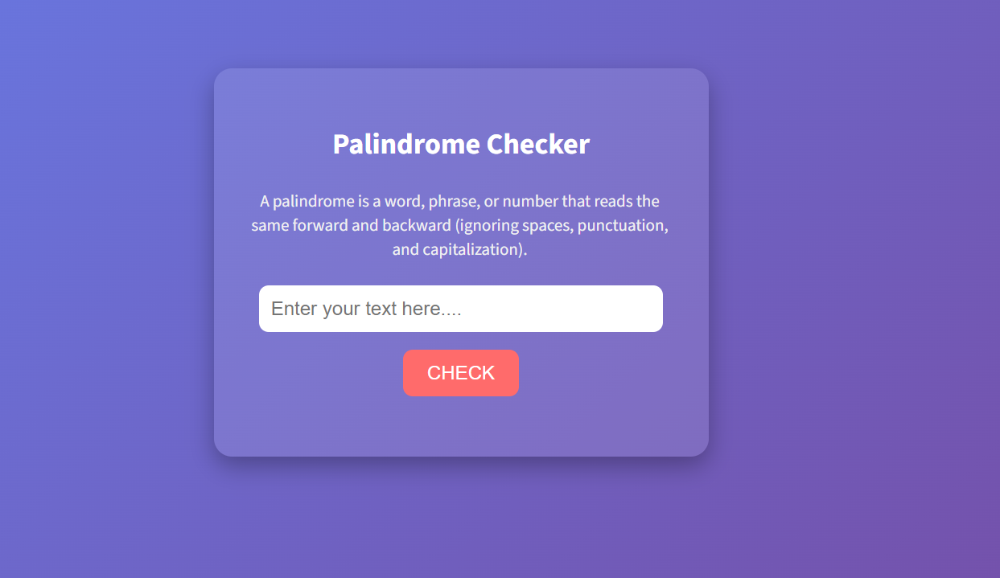

# 🔄 Palindrome Checker

A simple website to check if a word, phrase, or number is a **palindrome**.  
A palindrome is something that reads the same forward and backward (ignoring spaces, punctuation, and capitalization).

---

## 🚀 Live Demo

## 👉 [Click here to preview](https://kateykwesi.github.io/palindrome_checker/)

## 🖥️ How to Use

- Click the preview link above
- Type any text into the input box
- Press **Check** and see if it’s a palindrome ✅❌

---

## 📸 Screenshot

---

## 🚀 Features

- Check if text is a palindrome
- Ignores spaces, punctuation, and case
- Clean & modern UI

---

## 🛠️ Tech

- HTML
- CSS
- JavaScript

---

## 📜 License

MIT License © 2025
